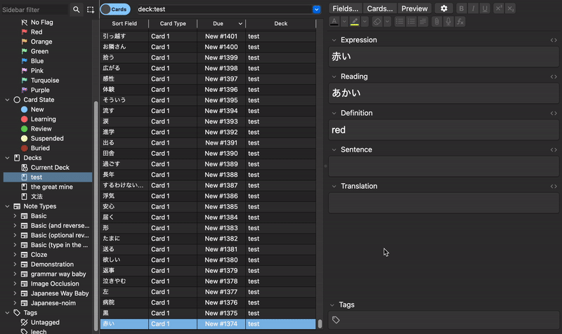

<div align="center">
  

  <h1>BunAI</h1>
  <h4> An Anki Add-On designed to generate example sentences for the words you're learning, along with their associated translations, to support your language learning journey! </h4>
</div>

## <i>Notice and Warning (!Please Read!)</i>
This Add-On <b>modifies</b> fields within your deck and replaces it with AI generated sentences. 
<br> 
<br>
***PLEASE BE CAUTIOUS AND CAREFUL WHEN CHOICING FIELDS TO REPLACE. ONCE YOU PRESS "GENERATE SENTENCES" YOU CANNOT RESTORE THE FIELDS BACK***
<br>
<br>
Using an OpenAi API will cost <b>money</b>, however the cost is relatively <b>cheap</b>. The rate that we were receiving during testing was about <b></b>

## Requirements
This Add-On was tested and used on the Anki Version ***24.06.3***.

You need an <b>OpenAI API Key</b> in order to use the Add-On. Please reference this guide if you need help obtaining a key: https://www.geeksforgeeks.org/how-to-get-your-own-openai-api-key/

## Installation

Please reference the how-to guide on installing the add-on: 
https://docs.ankiweb.net/addons.html

If you want to install <b>manually</b>:
```
git clone 'https://github.com/willdoesprojects/BunAI.git' ~/.local/share/Anki2/addons21/BunAI
```
***Note: This command works only of MacOS/Linux***
